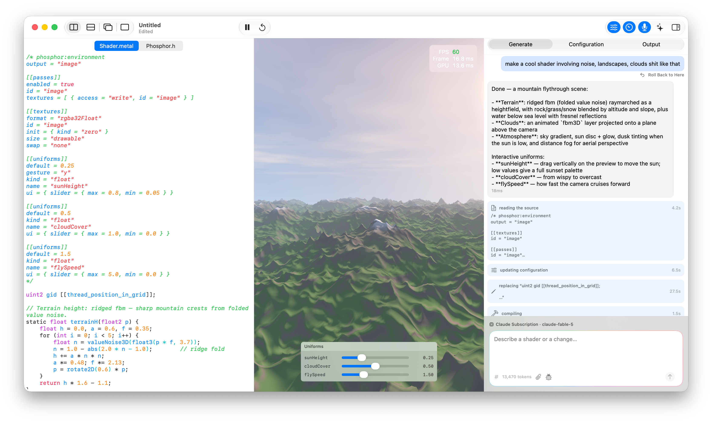

# Phosphor

A [Shadertoy](https://www.shadertoy.com)-like playground for Metal compute shaders, using AI to generate and modify shaders.

Built on [MetalSprockets](https://github.com/schwa/MetalSprockets), with the
parse / compile / render core and a reusable `PhosphorView` vended by
[PhosphorKit](https://github.com/schwa/PhosphorKit).

## Requirements

- macOS 27 (Golden Gate)

## Documents

Phosphor opens three kinds of document:

- **`.phosphor`** — a single-file shader stored as JSON, keeping the
  configuration (front-matter) separate from the Metal source. The preferred
  single-file format.
- **`.metal`** — a plain Metal source file with the configuration embedded as a
  `/* phosphor:environment ... */` TOML comment.
- **`.phosphord`** — a multi-file bundle holding several shaders plus image
  assets, edited via a sidebar.

## Shader generation

Conversational, agentic generation: describe an effect and the model edits the
live shader and compiles it as you watch. Pick a provider and model in
Settings → Models:

- **Claude Subscription** — log in with a Claude.ai subscription (unofficial
  OAuth; no API key needed).
- **Anthropic API** — your own billed Anthropic API key.
- **OpenAI** — your own OpenAI API key.

The model list for each provider is fetched live; your choice is remembered
per provider. Anthropic is the most reliable backend today. (An on-device /
Apple Intelligence path also exists as a fallback but is weaker.)

Generation is powered by [CollaborationKit](https://github.com/schwa/CollaborationKit).

## Links

Inspired by [Shadertoy](https://www.shadertoy.com/), [twigl.app](http://twigl.app) and <https://mini.gmshaders.com/p/decoding-phosphor>, amongst other things.

Sources for some (some of) original shaders:

- <https://shadered.org/view?s=NZzmcyHWfg>
- <https://fourways.readthedocs.io/en/latest/lesson4/fractals.html>
